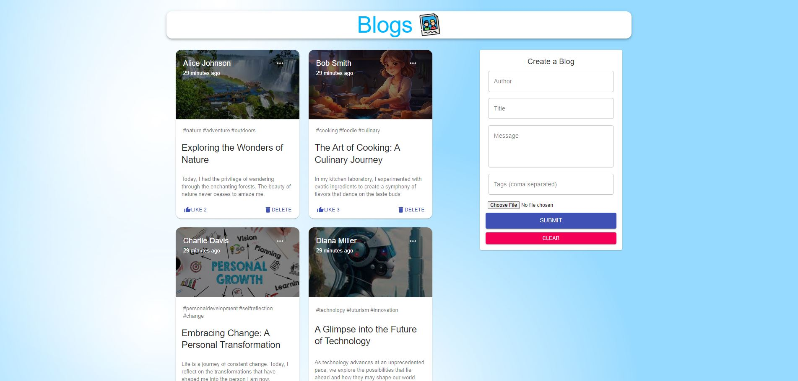
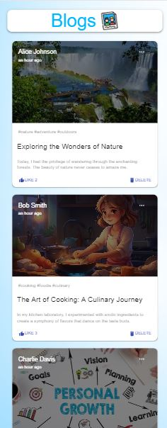

<p align="center">
  <a href="http://blogger-app-99.infinityfreeapp.com">
    
  </a>

  <h1 align="center">Blogger App</h1>

  <p align="center">
    A user-friendly Blogger app built with Love <3.
    <br />
    <a href="http://blogger-app-99.infinityfreeapp.com">View Demo</a>
    ·
    <a href="https://github.com/akash-dutta-dev/BloggerApp/issues">Report Bug</a>
    ·
    <a href="https://github.com/akash-dutta-dev/BloggerApp/issues">Request Feature</a>
  </p>
</p>
<br><br>
#Note - The demo link might not work. Please clone the repo and follow the instructions.
 <br>     
      
<!-- TABLE OF CONTENTS -->
# Table of content
<details open="open">
  <summary>List</summary>
  <ol>
    <li>
      <a href="#about-the-project">About The Project</a>
      <ul>
        <li><a href="#blogger-app">Blogger App</a></li>
        <li><a href="#our-aim">Our Aim</a></li>
        <li><a href="#built-with">Built With</a></li>
      </ul>
    </li>
    <li>
      <a href="#getting-started">Getting Started</a>
      <ul>
        <li><a href="#prerequisites">Demo</a></li>
        <li><a href="#installation">Installation</a></li>
      </ul>
    </li>
    <li><a href="#features">Features</a></li>
    <li><a href="#contributing">Contributing</a></li>
    <li><a href="#license">License</a></li>
    <li><a href="#contact">Contact</a></li>
  </ol>
</details>

<!-- ABOUT THE PROJECT -->

# About The Project

## Blogger App

Blogger App is a User-friendly Blog Management Application built with Love. [Click to open](http://blogger-app-99.infinityfreeapp.com)
<br><br>


## Our Aim

I believe a clean and simple blogging application helps you be more creative and get things done. We're all about providing a hassle-free blogging experience. Plus, this app will always be free for everyone to use. We think everyone should have access to a great tool for expressing themselves online. So, we're committed to keeping things simple, free, and open for everyone, always.

## Built With

### FrontEnd

- React
- Material UI
- Javascript
- SCSS/CSS
- HTML

### Backend

- NodeJs
- ExpressJs
- Mongoose
- Sessions

### Database

- MongoDB

<!-- Getting Started -->

# Getting Started

## Demo

To view the working demo -
Visit - http://blogger-app-99.infinityfreeapp.com
<br><br>

## Installation

- Creaet a account in MongoDB Atlas and create a cluster
- Clone the code and configure the `backend/index.js` to connect your cluster server.
- Then execute the following commands.

```
// For backend,
cd backend
npm install
node index.js

// For frontend
cd frontend
npm install
npm run dev
```

- The project will start running at `http://localhost:3000/`
- You will be prompted with a login box, you can enter any credentials to sign up. (Example - test@gmail.com, password).
- For new sign-ups, a few sample tasks will be automatically created.
- That's it. Enjoy.
  <br>

Let me know if you face any errors or issues.

## Features

### For assignment - Frontend

- User-friendly interface for the blog management application
- Form to create a new blog with fields for title, description, and tags.
- Ability to update the blog.
- Ability to delete a blog.
- Ability to edit a blog.
- Responsive user interactions
- Form validation
- Styling the application using CSS and Material UI

### For assignment - Backend

- RESTful API created to handle the CRUD operations for blog.
- Implemented a database to store task data.
- Implemented data models to represent tasks and users using moongoose
- Implemented server-side validation to save forms before entering into the database.
- Implemented correct status code for success and errors specific codes (200/201/400/401/500)
- Error handling while reading or writing to database.

### Additional features

- User login form with email and password validation.
- User state management using sessions.
- Blog sorting and searching capacities.

### Future Scope

- Team collaboration like admin can create a project and add members
- Admin can give create, read, and write access.
- Profile page.
- Comment Section

<!-- CONTRIBUTING -->

# Contributing

Contributions are what make the open-source community such an amazing place to learn, inspire, and create. Any contributions you make are **greatly appreciated**.

1. Fork the Project
2. Create your Feature Branch (`git checkout -b feature/AmazingFeature`)
3. Commit your Changes (`git commit -m 'Add some AmazingFeature'`)
4. Push to the Branch (`git push origin feature/AmazingFeature`)
5. Open a Pull Request

<!-- LICENSE -->

# License

Distributed under the MIT License. See `LICENSE` for more information.

<!-- CONTACT -->

# Contact

Email - akash.dutta9830489799@gmail.com

LinkedIn - https://www.linkedin.com/in/akash-dutta/

Instgram - https://www.instagram.com/akash_dutta97
